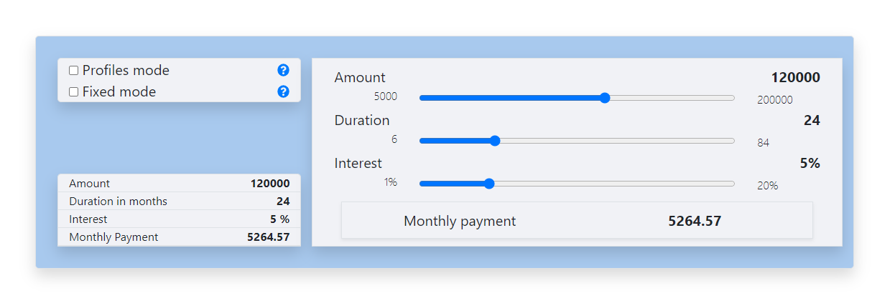
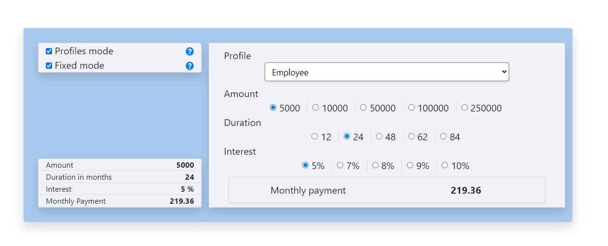

 
# Loan Simulator
> This project was bootstrapped with [Create React App](https://github.com/facebook/create-react-app).

## Table of contents
* [General info](#general-info)
* [Technologies](#technologies)
* [Setup](#setup)
* [Features](#features)
* [Screenshots](#screenshots)

## General info
This app provides a loan simulator, with a couple of modes and a recap block.
 
## Technologies
* [ReactJs](https://en.reactjs.org/)
* [React bootstrap](https://react-bootstrap.github.io/)

## Setup
First, you need to install the dependencies by running
`yarn install`

Then you can start the app by running
`yarn start`

The simulator data can be configured by editing the config file : 
`src/config/config.js`

## Features
* Calculate monthly payment 
* Show or hide profile field
* Use range inputs for open range values, and radio buttons for a defined list of possible values
* Show a recap of the current simulation

## Screenshots

